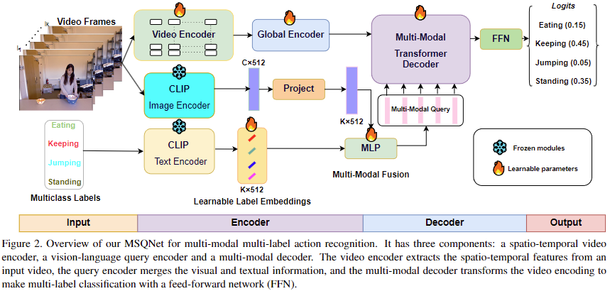

# MSQNet
Official implementation of "MSQNet: Actor-agnostic Action Recognition with Multi-modal Query", accepted at ICCV Workshops 2023.
## Authors
[Anindya Mondal*](https://scholar.google.com/citations?user=qjQmNJMAAAAJ&hl=en), [Sauradip Nag*](https://sauradip.github.io/), [Joaquin M Prada](https://www.surrey.ac.uk/people/joaquin-m-prada), [Xiatian Zhu](https://surrey-uplab.github.io/), [Anjan Dutta*](https://sites.google.com/site/2adutta/).
## Leaderboard
       
# Abstract
Existing action recognition methods are typically actor-specific due to the intrinsic topological and apparent differences among the actors. This requires actor-specific pose estimation (e.g., humans vs. animals), leading to cumbersome model design complexity and high maintenance costs. Moreover, they often focus on learning the visual modality alone and single-label classification whilst neglecting other available information sources (e.g., class name text) and the concurrent occurrence of multiple actions. To overcome these limitations, we propose a new approach called 'actor-agnostic multi-modal multi-label action recognition,' which offers a unified solution for various types of actors, including humans and animals. We further formulate a novel Multi-modal Semantic Query Network (MSQNet) model in a transformer-based object detection framework (e.g., DETR), characterized by leveraging visual and textual modalities to represent the action classes better. The elimination of actor-specific model designs is a key advantage, as it removes the need for actor pose estimation altogether. Extensive experiments on five publicly available benchmarks show that our MSQNet consistently outperforms the prior arts of actor-specific alternatives on human and animal single- and multi-label action recognition tasks by up to 50%.

The code will be released following the publication of the paper.

