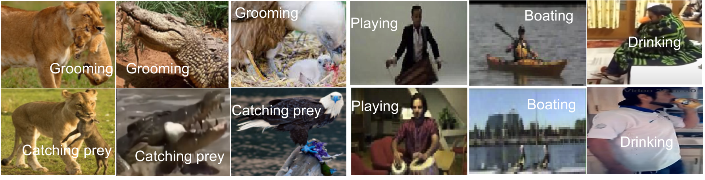
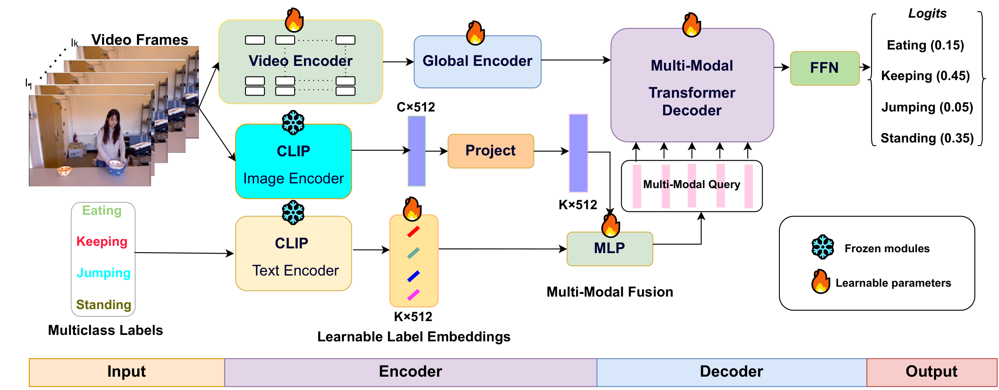
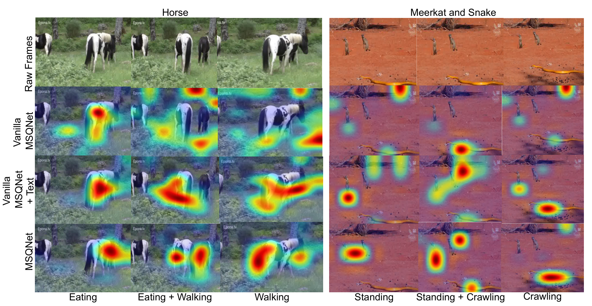
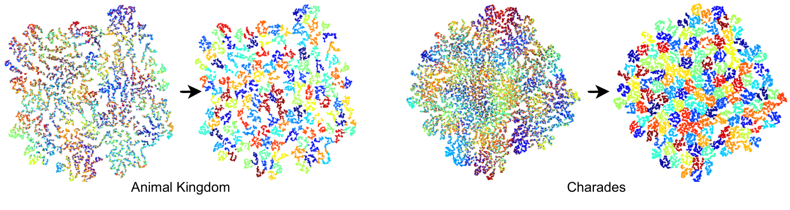

# MSQNet: Actor-Agnostic Multi-Label Action Recognition with Multi-Modal Query

<p align="center">
  <strong>ICCV Workshops (NIVT) 2023</strong><br>
  <a href="https://scholar.google.com/citations?user=qjQmNJMAAAAJ&hl=en">Anindya Mondal*</a> &bull;
  <a href="https://sauradip.github.io/">Sauradip Nag*</a> &bull;
  <a href="https://www.surrey.ac.uk/people/joaquin-m-prada">Joaquin M. Prada</a> &bull;
  <a href="https://surrey-uplab.github.io/">Xiatian Zhu</a> &bull;
  <a href="https://sites.google.com/site/2adutta/">Anjan Dutta*</a>
  <br>
  <em>* Equal contribution / Corresponding authors</em><br>
  <strong>University of Surrey, United Kingdom</strong>
</p>

<p align="center">
  <a href="https://mondalanindya.github.io/MSQNet/"></a>
  <a href="https://openaccess.thecvf.com/content/ICCV2023W/NIVT/html/Mondal_Actor-Agnostic_Multi-Label_Action_Recognition_with_Multi-Modal_Query_ICCVW_2023_paper.html"></a>
  <a href="https://arxiv.org/abs/2307.10763"></a>
  <a href="https://mondalanindya.github.io/assets/posters/ICCVW_23_poster.pdf"></a>
  <a href="https://youtu.be/bafoEVdQYJg?si=s-b-_EKBlgAHy4Q7"></a>
  <a href="LICENSE"></a>
  
  
</p>

### Leaderboard on Papers With Code
[](https://paperswithcode.com/sota/action-recognition-on-animal-kingdom?p=msqnet-actor-agnostic-action-recognition-with) 
[](https://paperswithcode.com/sota/action-recognition-in-videos-on-charades?p=msqnet-actor-agnostic-action-recognition-with) 
[](https://paperswithcode.com/sota/action-recognition-in-videos-on-hmdb51?p=msqnet-actor-agnostic-action-recognition-with) 
[](https://paperswithcode.com/sota/zero-shot-action-recognition-on-hmdb51?p=msqnet-actor-agnostic-action-recognition-with) 
[](https://paperswithcode.com/sota/action-recognition-on-hockey?p=msqnet-actor-agnostic-action-recognition-with) 
[](https://paperswithcode.com/sota/action-recognition-on-thumos14?p=msqnet-actor-agnostic-action-recognition-with) 
[](https://paperswithcode.com/sota/zero-shot-action-recognition-on-charades-1?p=msqnet-actor-agnostic-action-recognition-with) 
[](https://paperswithcode.com/sota/zero-shot-action-recognition-on-thumos-14?p=msqnet-actor-agnostic-action-recognition-with)

---

## 📌 News
- **Interactive Project Webpage**: Available at [https://mondalanindya.github.io/MSQNet/](https://mondalanindya.github.io/MSQNet/).
- **ICCV 2023 Workshops**: MSQNet accepted to the NIVT workshop at ICCV 2023.

---

## 📖 Overview

<p align="center">
  <br>
  <em>Figure 1: Large action variation across diverse actors (animals and humans). MSQNet eliminates the need for actor pose estimation, offering an actor-agnostic framework.</em>
</p>

Existing action recognition methods are typically **actor-specific** due to topological and morphological differences across actors (e.g., humans vs. quadrupeds, birds, reptiles). This typically demands specialized pose estimation models and limits generalization.

To solve this, we propose **actor-agnostic multimodal multi-label action recognition** and formulate **MSQNet (Multimodal Semantic Query Network)**:
1. **Actor-Agnostic**: Formulates multi-label video classification in a DETR-style detection framework without requiring actor pose or bounding boxes.
2. **Multimodal Query Formulation**: Fuses CLIP text representations of class names with CLIP video features to formulate rich action queries.
3. **State-of-the-Art Performance**: Outperforms prior actor-specific models on Animal Kingdom (+47.85% mAP boost), Charades, Thumos14, Hockey, and HMDB51, with strong zero-shot transfer capabilities.

<p align="center">
  <br>
  <em>Figure 2: Architecture of MSQNet comprising a Spatio-Temporal Video Encoder, Multimodal Query Encoder, and Multimodal Transformer Decoder.</em>
</p>

---

## 🔬 Benchmark Results

### Supervised Action Recognition

| Dataset | Metric | Prior Art | Prior Score | **MSQNet (Ours)** | Improvement |
| :--- | :--- | :--- | :---: | :---: | :---: |
| **Animal Kingdom** | mAP | CARe (ICCV '21) | 25.25% | **73.10%** | **+47.85%** |
| **Charades** | mAP | ActionCLIP | 44.30% | **47.57%** | **+3.27%** |
| **Thumos 14** | Accuracy | BMN | 62.12% | **83.16%** | **+21.04%** |
| **Hockey** | Multilabel Acc | AFAC | 96.30% | **96.95%** | **+0.65%** |
| **HMDB51** | Accuracy | VideoMAE V2-g | 88.10% | **93.25%** | **+5.15%** |

### Zero-Shot Action Recognition

| Split | Method | Thumos 14 (Acc) | Charades (mAP) | HMDB51 (Acc) |
| :--- | :--- | :---: | :---: | :---: |
| Reported Prior SOTA | VideoCOCA / BIKE | - | 25.80% | 61.40% |
| **50% Seen Split** | **MSQNet (Full Model)** | **63.98%** | **30.91%** | **59.24%** |
| **75% Seen Split** | **MSQNet (Full Model)** | **75.33%** | **35.59%** | **69.43%** |

---

## 🛠️ Environment Setup

### Option A: Using `pip`
```bash
git clone https://github.com/mondalanindya/MSQNet.git
cd MSQNet
pip install -r requirements.txt
```

### Option B: Using `conda`
```bash
conda env create -f environment.yml
conda activate msqnet
```

### Option C: Editable Package Install
```bash
pip install -e .
```

### Verify Environment
Run the included verification script to confirm dependencies, model modules, and forward passes:
```bash
python verify_environment.py
```

---

## 📂 Dataset Setup

Datasets can be placed under `./datasets` or referenced directly using `--data_dir <path>` or the environment variable `MSQNET_DATA_DIR`.

Expected folder hierarchy:
```text
datasets/
├── AnimalKingdom/
│   └── action_recognition/
│       ├── annotation/
│       │   ├── train_light.csv
│       │   └── val_light.csv
│       └── dataset/
│           └── image/
│               ├── [video_id_001]/
│               │   ├── 00001.jpg
│               │   ├── 00002.jpg
│               │   └── ...
├── Charades/
│   ├── Charades_v1_train.csv
│   ├── Charades_v1_480/
│   └── ...
├── Hockey/
│   ├── period1-gray/
│   └── ...
├── THUMOS14/
│   ├── annotation/
│   └── ...
└── Volleyball/
```

### Generating Animal Kingdom Lighter Annotations
```bash
python multi-label-action-main/utility/lighter_annotations.py \
    --input /path/to/train.csv \
    --output ./datasets/AnimalKingdom/action_recognition/annotation/train_light.csv

python multi-label-action-main/utility/lighter_annotations.py \
    --input /path/to/val.csv \
    --output ./datasets/AnimalKingdom/action_recognition/annotation/val_light.csv
```

### Extracting Video Frames
```bash
python multi-label-action-main/utility/extract_frames.py \
    --video_dir /path/to/videos \
    --pattern "*.avi" \
    --output_dir ./datasets/Hockey
```

### Testing with a Synthetic Toy Dataset
To test the pipeline without downloading large datasets:
```bash
python multi-label-action-main/utility/create_dummy_dataset.py --output ./datasets
```

---

## 🚀 Training & Evaluation

You can train and evaluate directly from the root using `run.py` or through the scripts in `scripts/`.

### 1. Training MSQNet
```bash
# Single GPU training
python run.py \
    --dataset animalkingdom \
    --model msqnet \
    --data_dir ./datasets \
    --batch_size 16 \
    --epochs 100 \
    --total_length 16 \
    --train True

# Multi-GPU Distributed (DDP) training
python multi-label-action-main/dist_main.py \
    --dataset animalkingdom \
    --model msqnet \
    --data_dir ./datasets \
    --batch_size 8 \
    --total_length 16 \
    --distributed True
```

Or run the bash / batch scripts:
```bash
# Linux / macOS
bash scripts/train_msqnet.sh animalkingdom msqnet ./datasets 16 100 16

# Windows
scripts\train_msqnet.bat animalkingdom msqnet ./datasets
```

### 2. Evaluating a Checkpoint
```bash
python run.py \
    --dataset animalkingdom \
    --model msqnet \
    --data_dir ./datasets \
    --checkpoint ./checkpoints/msqnet_msqnet_animalkingdom.pth \
    --total_length 16 \
    --train False
```

Or run the evaluation scripts:
```bash
# Linux / macOS
bash scripts/eval_msqnet.sh ./checkpoints/msqnet_msqnet_animalkingdom.pth animalkingdom

# Windows
scripts\eval_msqnet.bat ./checkpoints/msqnet_msqnet_animalkingdom.pth animalkingdom
```

---

## 🎨 Qualitative Results & Visualizations

<p align="center">
  <br>
  <em>Video Demonstration: MSQNet multi-label temporal action prediction across unconstrained video snippets.</em>
</p>

<p align="center">
  <br>
  <em>Attention Rollouts: GradCAM heatmaps showing how multimodal queries focus attention onto active bodies and interacting regions.</em>
</p>

<p align="center">
  <br>
  <em>t-SNE Embeddings: Action class clusters before and after the multimodal transformer decoder on Animal Kingdom and Charades.</em>
</p>

---

## 🌐 Webpage

A self-contained, responsive academic project page is provided in `index.html` (and `docs/index.html`).
- **Live URL**: [https://mondalanindya.github.io/MSQNet/](https://mondalanindya.github.io/MSQNet/)
- Open `index.html` locally in any browser for an interactive experience.

---

## 📚 Citation

If you find our work useful, please consider citing:

```bibtex
@InProceedings{Mondal_2023_ICCV,
    author    = {Mondal, Anindya and Nag, Sauradip and Prada, Joaquin M and Zhu, Xiatian and Dutta, Anjan},
    title     = {Actor-Agnostic Multi-Label Action Recognition with Multi-Modal Query},
    booktitle = {Proceedings of the IEEE/CVF International Conference on Computer Vision (ICCV) Workshops},
    month     = {October},
    year      = {2023},
    pages     = {784-794}
}
```

---

## 📄 License
This repository is licensed under the [MIT License](LICENSE).
